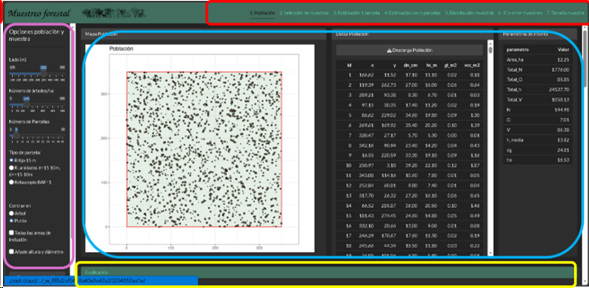

**2.1 Forest Sampling Application**

This application has been developed for the Forestry Silviculture and Inventory course of the Bachelor's Degree in Forestry Engineering: Forest Industries, taught at the EiFAB in Soria, University of Valladolid. The application covers the sampling block, with the exception of stratified sampling.

The application is organized into seven tabs or screens, each dedicated to a specific aspect of the sampling block, which should be viewed sequentially. Each tab includes a section with theoretical explanations.

The interface is divided into four main areas (Figure 1).

-   At the top (red box) is the topic selector, designed for sequential use.
-   The left panel (purple) contains the main controls of the application.
-   In the central area (blue), the graphical and tabular outputs corresponding to each topic are displayed.
-   Finally, at the bottom (yellow), the associated theoretical explanations appear.

**The display size can be adjusted using the combination of the Ctrl key and the mouse scroll wheel**, which allows you to zoom in or out on the elements. Note: the application is currently on a free hosting service that is not very fast; populations take between one and five seconds to regenerate, so please be patient.

Figure 1. Sections of the Forest Sampling application.

Available tabs:

1.  [Population](help/1_Population.Rmd)

2.  [Sample selection](help/2_Selection.Rmd)

3.  [Estimation with one plot](help/1_OnePlot.Rmd)

4.  [Estimation with n plots (point estimation)](help/4_nPlots.Rmd)

5.  [Estimation with n plots (sampling distribution)](help/5_Samp_dist.Rmd)

6.  [Estimation with n plots (confidence intervals and sampling error)](help/6_Interval_error.Rmd)

7.  [Estimation with n plots (sample size determination)](help/7_Samp_aloc.Rmd)