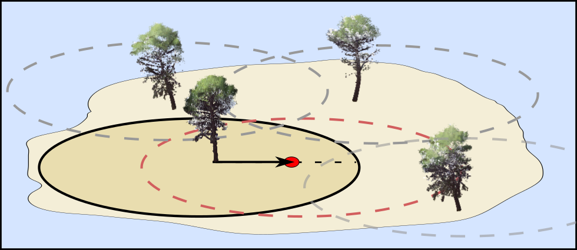
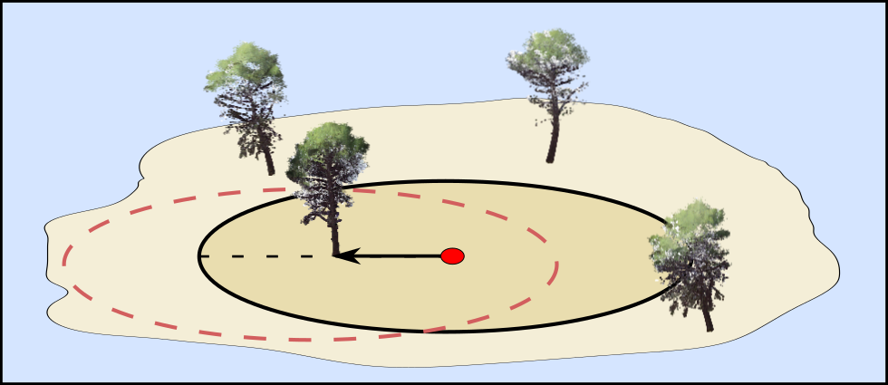
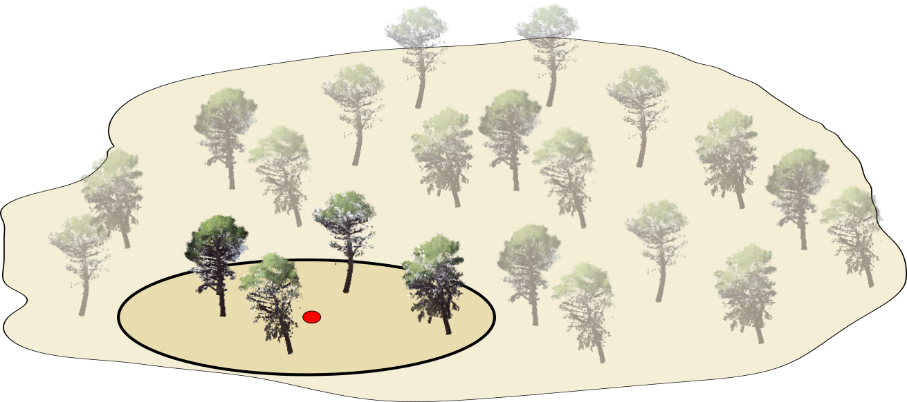

#### Introduction

We are going to consider the random experiment of locating a plot uniformly at random within the area to be sampled. Based on the location of this point, the trees that will form the sample will be determined. Since the location of the sampling point is random, the trees that form the sample will also be random. We can analyze the sample selection process from two complementary perspectives that will allow us to deduce, in a simple and visual way, inclusion probabilities in the sample ($\pi_i$) and expansion factors ($w_i$) that will be useful in the estimation process.

Before continuing, let's take a closer look at both ways of visualizing the problem using fixed-radius plots. A tree will be measured when the distance between the tree and the randomized point (plot center) is less than a distance determined by the plot type (plot radius or radii). When measuring distances, it does not matter which point we consider as the origin; the distance from the center to the tree is the same as from the tree to the plot center. However, from a purely visual standpoint, checking distances by positioning ourselves at the tree provides an alternative view to positioning ourselves at the plot center, and both are interesting.

#### Selection Based on Tree-Centered Inclusion Areas

The first way to view when we would sample a tree is to focus on the tree itself. We will begin by drawing around each tree a circle with the plot radius corresponding to the tree's diameter and plot type. We will call these circles the tree's inclusion areas. The distance between the measurement point and a given tree will be less than the corresponding plot radius if the measurement point falls inside the inclusion area or circle drawn around the tree. That is, the trees to be measured will be those for which the measurement point has fallen inside their inclusion area.

{width="100%"}

#### Inclusion Probabilities in the Sample

In this representation, it is very simple to infer tree inclusion probabilities (except for edge trees). The probability that a specific tree is included in the sample is the probability of falling within its inclusion area. Since sampling points are determined uniformly at random, for tree $i$, this inclusion probability $\pi_i$ will be the ratio between the area of selection (plot area based on tree diameter), $a_{inclusion,i}$, and the total area to be sampled $A$, with both areas in the same units. That is:

$$
\pi_i = \frac{a_{inclusion,i}}{A}
$$

#### Selection Based on Plot-Centered Areas

The way of selecting the sample that most closely resembles what we do in the field is to focus on the measurement point and draw a circle (or circles for variable-radius and relascope plots) around the measurement point or plot center. The trees that will form the sample will be those within the circle (or circles) drawn around the plot center.

{width="100%"}

#### Expansion Factors

While the tree-centered viewpoint is very graphic when determining probabilities of including a specific tree in the sample, the sampling-point-centered approach allows us to make very graphic interpretations of what we call expansion factors. To see expansion factors, we will use an example where we assume we have sampled a two-hectare area with a plot radius resulting in a surface area of $1/3$ hectare. Four trees have entered our plot.

{width="100%"}

If we know that our plot is $\frac{1}{3}$ hectare, based on our measurements we would expect to have $3 \times 4 = 12$ trees in each hectare and 24 in the area to be sampled. In reality, there are 22 trees in the sampled area and $N=11$ trees per hectare; however, we can see that the inverse of the plot area $\frac{1}{a_{inclusion}(ha)}$ allows us to approximate the total value of trees per hectare and the total number of trees. **Basically, we extrapolate or expand what we have measured in the one-third hectare plot to one hectare, and from there to the total sampled surface area.**

The inverse of the plot area is called the expansion factor $w_i=\frac{1}{a_{inclusion,i}(ha)}$ and has a very intuitive interpretation. If the inclusion area of a tree is $\frac{1}{k}$ ha, then in one hectare we expect to find $k$ trees similar to the sampled tree. Importantly, in these examples we have used fixed-radius plots, and all inclusion areas are equal; when we have nested-radius or relascope plots, the inclusion area depends on the tree's diameter, which is why we include the subscript $i$ identifying the tree in the expansion factor.

**Example 1:**

If we have fixed-radius plots where the inclusion area for all trees is 0.1 hectares, for every tree we sample, we would expect to have 10 trees in each hectare.

**Example 2:**

If we have variable-radius plots where trees smaller than 7.5 cm are sampled with an area of 0.05 ha and larger trees with a radius equivalent to an area of 0.1 ha, then:

- For every smaller tree sampled, we would expect to find 20 similar trees per hectare.

- For every larger tree, we would expect to find 10 similar trees per hectare.

#### Inclusion Areas and Expansion Factors

Expansion factors are directly related to inclusion probabilities.

**Normally, sampled areas are measured in hectares, so it is more convenient if we always express plot areas and sampled areas in these units. This is not mandatory, but it is necessary to know which units are being worked with and to be consistent, especially when calculating inclusion probabilities where it is necessary to use the same units in both the numerator and denominator.**

Since the area to be sampled $A$ is normally known, through algebraic manipulation we can relate expansion factors and inclusion probabilities as follows:

$$
w_i = \frac{1}{a_{inclusion,i}(ha)} \quad \text{and} \quad \pi_i=\frac{a_{inclusion,i}(ha)}{A(ha)} \rightarrow \pi_i=\frac{1}{A(ha)w_i}
$$

We can also use this equation to establish the expansion factor as:

$$w_i=\frac{1}{A(ha)*\pi_i}$$

#### Tab Controls

In this tab you can experiment with different plot designs. In the upper part, you have the tree selection process based on inclusion areas. In the lower part, you have the selection process centered on the measurement point.

If you activate the **All inclusion areas** control, you can see the inclusion area of each tree for the different plot types. Upon clicking the **Sample** button, you will see how the selected trees are highlighted (that is, those for which the plot point fell within the inclusion area).

The following plot types are considered:

**Fixed radius**

For fixed-radius plots, the inclusion probability in the sample $\pi_i$ for tree $i$ is:

$$
\pi_i = \frac{\pi r_p^2(ha)}{A(ha)}
$$

where $r_p$ is the plot radius and $A$ is the area sampled in the same units. The expansion factor in this case is equal for all trees and equals the inverse of the plot area in hectares $w_i=\frac{1}{\pi r^2(ha)}$.

**Nested radii**

For nested-radius plots, the inclusion probability in the sample $\pi_i$ for tree $i$ is:

$$\pi_i = \begin{cases}
\frac{\pi r_1^2(ha)}{A(ha)}, & \text{if } dbh<15\text{cm}\\
\frac{\pi r_2^2(ha)}{A(ha)}, & \text{if } dbh \ge 15\text{cm}
\end{cases}$$

where $r_1=10$ and $r_2=20$ are the radii associated with size classes 1 (smaller than 15 cm in diameter at breast height) and 2 (diameter at breast height greater than or equal to 15 cm) in the example. $A$ is the area sampled. **Important:** we have considered only two size classes and therefore two plot radii. If there were more than two classes, the procedure would be the same, but we would have more cases. Furthermore, with nested-radius and relascope plots, it can visually be difficult to establish which radius corresponds to which tree.

Based on inclusion probabilities, we can establish expansion factors:

$$w_i = \begin{cases}
\frac{1}{\pi r_1^2(ha)}, & \text{if } dbh<15\text{cm}\\
\frac{1}{\pi r_2^2(ha)}, & \text{if } dbh \ge 15\text{cm}
\end{cases}$$

**Relascope**

The last plot type considered is relascope plots with a BAF of 1. When the BAF is 1, the inclusion area of a tree has a radius/diameter equal to the radius/diameter of the tree, but expressed in meters. In this case, the inclusion area in hectares is equal to $\pi_i = \frac{\pi dbh_i^2}{4*1000}$. Based on this, the inclusion probability of tree $i$ can be calculated as:

$$\pi_i = \frac{\pi dbh_i^2}{4*10000}*\frac{1}{A}$$

The expansion factor in this case is equal to:

$$w_i=\frac{1}{\frac{\pi dbh_i^2}{4*10000}}$$

In nested-radius plots we have only considered two size classes, but this does not always have to be the case; as many classes as desired could be considered. In this sense, the relascope is a generalization of nested-radius plots where there are infinite possible plot sizes, one for each possible diameter at breast height. That is, each tree has its own plot radius or diameter proportional to its diameter at breast height.

#### Edge Effects

In the previous explanations and formulas, we have not considered what happens with trees whose inclusion area intersects the boundaries of the area to be sampled. For these trees, the area we would have to consider when determining inclusion probabilities would only be the portion inside the sampled zone. For the rest of this course, we will simply consider these effects to be negligible. Although we will not conduct a formal treatment of these edge effects, you can graphically verify that they tend to become very small as you increase the side length of the area to be sampled.