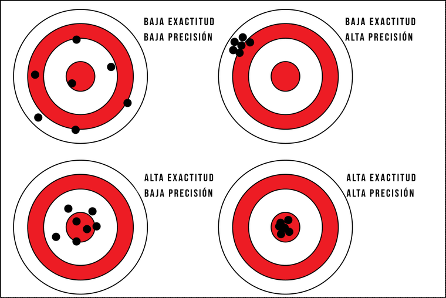
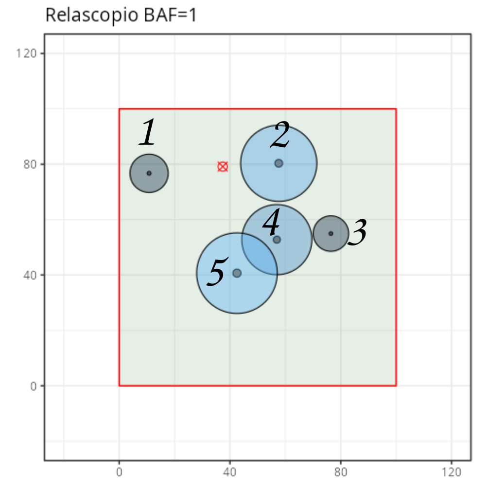
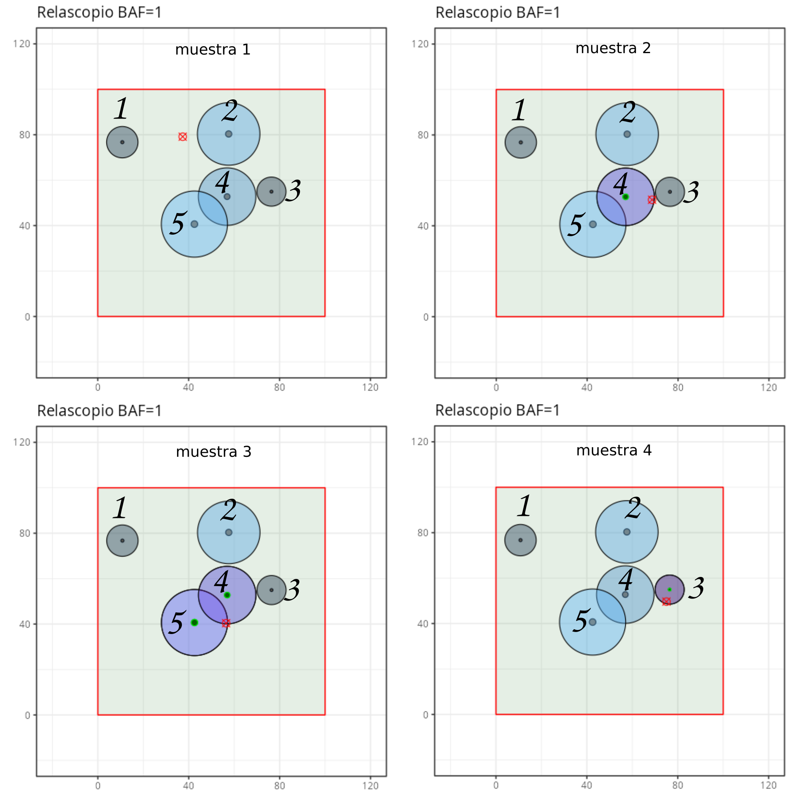

#### Introduction

This tab explains how to estimate a parameter of interest (see the **Population** tab) when considering the random experiment of:

1.  Selecting a location at random within the area to be sampled.
2.  Selecting the trees that will compose the sample based on the type of plot used.
3.  Calculating plot estimates from the set of selected trees.

The basis of the estimation will be the Horvitz-Thompson estimator for totals or its version for totals per unit area. Both versions can be interchanged almost directly since the area to be sampled $A$ is usually known.

Before continuing, it is recommended to click the **Regenerate population** button to avoid accumulating samples from tests performed in previous tabs.

#### Parameters of Interest

Let's review the types of parameters of interest we saw in Tab 1 (**Population**). It is important to keep in mind that we will never know these values in real scenarios, and our goal is to estimate them.

***Totals***

Generically, a total is defined as the sum of a variable of interest $y_i$ for all trees $i$ in the sampled area. A total per unit area simply consists of dividing the total by the sampled area. If we use the symbol $\mathcal{N}$ (**rounded $N$**) to represent the number of trees in the sampled area (**unknown parameter**), totals and totals per unit area are expressed as:

$$Total(y)=\sum_{i=1}^{\mathcal{N}}y_i \qquad \qquad \text{Total per unit area}(y)=\frac{1}{A}\sum_{i=1}^{\mathcal{N}}y_i$$

Two examples of totals per unit area are density $N$ and basal area $G$. For density, $N$ (**straight $N$**), $y_i$ is equal to 1 for all trees; for $G$, $y_i$ is the cross-sectional area at breast height (in square meters) of each tree.

***Functions of Totals***

Although totals are almost certainly the most important parameters of interest in forest inventories, many forest mensuration variables we want to estimate are not totals themselves, but rather functions involving more than one total. Outstanding among these functions are mean values.

$$Mean(y)=\frac{\sum_{i=1}^{\mathcal{N}}y_i}{\mathcal{N}}=\frac{\sum_{i=1}^{\mathcal{N}}y_i}{\sum_{i=1}^{\mathcal{N}}1}$$

However, $\mathcal{N}$ itself is a total where $y_i$ is 1 for all trees, so **mean values are ratios of totals**.

Another example of a parameter of interest expressed as a function of totals is the quadratic mean diameter $d_g$. Starting from the definition of $d_g$ (the diameter corresponding to the tree of mean basal area), we see that $d_g$ is a function of two totals: $G$ and $N$.

$$\frac{\pi d_g^2(m)}{4}=\frac{AG}{AN} \rightarrow d_g(m) = \sqrt{\frac{4G}{\pi N}}\rightarrow d_g(cm)=100*d_g(m)$$

***Other Complex Parameters***

There are forest variables that are not totals, functions, or ratios of totals. Notably in this category are dominant heights and dominant diameters, which are usually defined as the mean heights or diameters of the set of dominant trees, $\mathcal{D}$.

$$h_o= \frac{1}{\mathcal{N_{D}}}\sum\limits_{i\in D}h_i$$

$$d_o= \frac{1}{\mathcal{N_{D}}}\sum\limits_{i\in D}d_i$$

Under Assmann's criterion, the set of dominant trees consists of the 100 trees with the largest diameters per hectare.

#### Horvitz-Thompson Plot Estimator for Totals or Totals per Unit Area

This section explains how plot estimates (center and middle panels) are obtained from tree measurements (left panel).

When our goal is to estimate a total or a total per unit area, we use the Horvitz-Thompson plot estimator, though from now on we will simply refer to it as the plot estimator for totals or totals per unit area.

To denote estimates, we add a caret $\hat{~}$ over the parameter of interest. Below is how the plot estimator is calculated for a total and for a total per unit area:

$$\hat{Total(y)}=\begin{cases}
\sum\limits_{i\in sample}\frac{y_i}{\pi_i} , & \text{if any tree is selected} \\
 & \\
0, & \text{if no tree is selected}
\end{cases}$$

$$\hat{Total~per~unit~area(y)}=\begin{cases}
\frac{1}{A}\sum\limits_{i\in sample}\frac{y_i}{\pi_i} = \sum\limits_{i\in sample}\frac{y_i}{A\frac{a_{plot,i}}{A}} = \sum\limits_{i\in sample}y_iw_i , & \text{if any tree is selected} \\
 & \\
0, & \text{if no tree is selected}
\end{cases}$$

Two important points should be mentioned. First, both estimators equal zero if the sample is empty (that is, if no tree is selected). Second, for totals per unit area, the sampled area $A$ divides the total, but it also appears implicitly in the $\pi_i$. These areas cancel out, resulting in an extremely simple estimator where all you need to do is multiply the variable of interest $y_i$ by the expansion factor $w_i$ and sum for all trees in the plot. Or alternatively, divide the value of the variable of interest $y_i$ of each selected tree by its corresponding inclusion area or plot area $a_{plot,i}$ and sum.

$$\hat{Total ~ per ~ unit~area(y)}=\begin{cases}\sum\limits_{i\in sample}\frac{y_i}{a_{plot,i}}= 
\sum\limits_{i\in sample}y_iw_i  , & \text{if any tree is selected} \\
 & \\
0, & \text{if no tree is selected}
\end{cases}$$

If you prefer not to memorize formulas, you can deduce them by remembering: (1) the interpretation of the expansion factor as the number of trees similar to the sampled tree that we expect to find in one hectare of land, and (2) that a total per unit area is the sum of the variable of interest for all trees in a hectare. Since each sampled tree represents $w_i$ trees in a hectare, all you do is sum the variable of interest of each sampled tree $y_i$ multiplied by $w_i$ (the number of trees tree $i$ represents per hectare).

In the left panel of this tab, you have the tree-level measurements that would be made in the plot. Remember that to obtain a given total per unit area, simply multiply the column of the variable of interest by its corresponding expansion factor and sum them up. If we want to estimate $N$, this column is always 1, so $y_i*w_i=1*w_i=w_i$, and it suffices to sum the expansion factors. You can download simulated plot data and practice in Excel: start by calculating the inclusion areas or $w_i$ for each tree based on its diameter at breast height.

***Example 1:***

$$\hat{G}=\begin{cases}
\sum\limits_{i\in sample}g_iw_i  , & \text{if any tree is selected} \\
 & \\
0, & \text{if no tree is selected}
\end{cases}$$

**IMPORTANT:** Read the section **Use and History of the Relascope** at the bottom of this page.

***Example 2:***

$$\hat{N}=\begin{cases}
\sum\limits_{i\in sample}1w_i  , & \text{if any tree is selected} \\
 & \\
0, & \text{if no tree is selected}
\end{cases}$$

#### Plot Estimator for Ratios and Functions of Totals

When estimating mean parameters (ratios of totals) or functions of totals, we simply apply the plot estimator to each of the individual totals.

***Example 3:***

If the parameter of interest is mean height:

$$\bar{h}=\frac{\sum_{i=1}^{\mathcal{N}}y_i}{\mathcal{N}}=\frac{\frac{1}{A}\sum_{i=1}^{\mathcal{N}}y_i}{\frac{1}{A}\sum_{i=1}^{\mathcal{N}}1}$$

Mean height is the ratio of two totals per unit area: the total height ($y_i\rightarrow h_i$) and $N$ (the total of a variable that equals 1 for all trees). In this case, we calculate the plot estimator for the numerator and the plot estimator for the denominator, then divide them.

$$\hat{\bar{h}}=\frac{\sum\limits_{i\in sample}h_iw_i}{\sum\limits_{i\in sample}1w_i}$$

***Example 4:***

To estimate $d_g$, we estimate $G$ and $N$ as in Examples 1 and 2, then substitute them into the $d_g$ equation to obtain the plot estimator:

$$\hat{d_g}(cm) = 100 \sqrt{\frac{4\hat{G}}{\pi \hat{N}}}$$

For parameters of this type, 0/0 indeterminacies can occur; in such cases, no information is available and estimation is impossible.

#### Plot Estimator for Complex Parameters (Dominant Heights and Diameters)

For dominant heights and diameters, estimation is performed by constructing plot analogs. First, sort the measurement table by diameter in descending order. Then, sum the expansion factors until reaching 100 trees per hectare. This identifies the plot's estimated set of dominant trees. Once we have this set $\hat{dominant}$, simply calculate the mean values as in Example 3, working exclusively on the dominant tree set:

$$\hat{h_o}= \frac{\sum\limits_{i\in \hat{dominant}}h_iw_i}{\sum\limits_{i\in \hat{dominant}}w_i}$$

and

$$\hat{d_o}= \frac{\sum\limits_{i\in \hat{dominant}}d_iw_i}{\sum\limits_{i\in \hat{dominant}}w_i}$$

From a practical perspective, the simplest method in Excel is creating a new column where non-dominant trees have an expansion factor of zero, allowing you to use pivot tables easily.

To strictly adhere to Assmann's definition, for the last tree in the dominant set, reduce its expansion factor so the sum of all expansion factors equals exactly 100, assigning zero to all non-dominant trees (we can use $w_i^*$ to denote these modified expansion factors). The denominator sum simplifies to 100 trees per hectare, expressing the estimators as:

$$\hat{h_o}= \frac{\sum\limits_{i\in \hat{dominant}}h_iw_i^*}{\sum\limits_{i\in \hat{dominant}}w_i^*}=\frac{\sum\limits_{i\in \hat{dominant}}h_iw_i^*}{100}$$

and

$$\hat{d_o}= \frac{\sum\limits_{i\in \hat{dominant}}d_iw_i^*}{\sum\limits_{i\in \hat{dominant}}w_i^*}=\frac{\sum\limits_{i\in \hat{dominant}}d_iw_i^*}{100}$$

#### Properties of the Plot Estimator

***Expected Value, Accuracy, and Bias***

For totals or totals per unit area, it can be proven that the plot estimator will be unbiased if edge effects are negligible. That is, if edge effects can be ignored, the expected value of the estimator equals the true value being estimated:

$$\boxed{\boxed{ E(\hat{Total(y)}) = Total(y)}}$$

or

$$\boxed{\boxed{ E\left(\frac{\hat{Total(y)}}{A}\right) = \frac{Total(y)}{A}}}$$

If we could infinitely repeat the sampling and estimation process, the mean of those infinite estimates would match the true parameter value. **This property is highly significant because it holds regardless of the population or plot type—the only requirement is that edge effects be negligible, which is typically the case.** At the end of this document, an optional reading outlines the reasoning behind proving that estimators for totals or totals per unit area are unbiased.

In theory, two key estimator properties are bias and variance. Bias tells us how close, on average, we come to the true parameter value. An estimator with low bias is said to have high accuracy. Precision, measured via variance or standard deviation, informs us about the variability of values obtained when using an estimator. A precise estimator has low variance, whereas an imprecise estimator fluctuates widely and has high variance.

When edge effects are small, the plot estimator for totals or totals per unit area is unbiased (its expected value matches the parameter to be estimated). Thus, for totals and totals per unit area (with negligible edge effects), we are guaranteed to be in the bottom row of the diagram above—whether on the left (low precision = high variance) or right (high precision = low variance), but definitely in the bottom row.

Unfortunately, this property applies *only* to totals and totals per unit area with negligible edge effects. **For ratios, functions of totals, and complex parameters, freedom from bias cannot be guaranteed.** While we have seen how plot estimators behave regarding bias, variance or standard deviation reflects their precision. Unfortunately, plot estimator variance directly relates to the spatial distribution of trees, which is impossible to know *a priori*. **Thus, we can only estimate these variances by repeating the random plot selection experiment multiple times.**

#### Repeating the Random Plot Selection Experiment (Right Panel)

As a bridge to the more realistic process of measuring multiple plots, we can observe what happens when we repeat the process of selecting a random point, sampling trees, and computing estimates multiple times.

At the top (in red), you can see how plot estimates for six variables distribute as sampling is repeated. The true parameter value (known because this is a simulated population) is marked with a vertical black line. The mean of all accumulated estimates is shown as a thick blue dot.

Finally, as more plots are added, the frequency distribution of estimated values forms a gray curve. If sampling could be repeated infinitely, this frequency distribution represents the *sampling distribution* of the estimator, which is fundamental for analyzing precision and bias.

**In this panel, observe two crucial behaviors:**

For totals, as more plots are measured and averaged, the blue dot converges closer to the true parameter value. This is a direct consequence of the unbiasedness of plot estimators for totals and totals per unit area.

If the boundary length of your population area is small, systematic deviation or bias may occur because the inclusion probabilities or expansion factors do not account for edge effects where tree inclusion areas intersect boundaries. In practical applications, sampling areas are large, so edge effects tend to be minor. You can verify this by generating populations with larger side lengths:

-   **In the** **Sample Selection** tab, you will see that inclusion areas intersecting boundaries become proportionally less significant.
-   **In this tab**, you will see the mean of totals per unit area estimates converge closer to the true value; that is, total bias disappears. Finally, as more samples are added, the mean fluctuates less, while individual plot estimate variability remains within a wider range. Subsequent tabs explore the relationship between single-plot variance and the variance of an $n$-plot mean.

#### Using the Relascope to Estimate Basal Area

Let's revisit Example 1 to detail what happens when following relascope instructions. In the introduction, we called plot estimators for totals "Horvitz-Thompson type estimators"; let's briefly revisit this terminology. We distinguish the Horvitz-Thompson plot estimate, denoted $\hat{G}_{HT}$, from the relascope estimate, denoted $\hat{G}_{relascope}$:

$$\hat{G}_{HT}=\begin{cases}
\sum\limits_{i\in sample}g_iw_i  , & \text{if any tree is selected} \\
 & \\
0, & \text{if no tree is selected}
\end{cases}$$

Expressing basal area in $m^2/ha$:

$$\hat{G}_{HT}=\sum_{i \in sample}\frac{\pi dbh_i^2}{4*10000}w_i$$ 

where $dbh_i$ is the diameter at breast height of tree $i$ in cm, and 10000 converts $cm^2$ to $m^2$. The plot expansion factor $w_i$ is derived knowing that the inclusion area diameter (or radius) is $k$ times the tree's $dbh$ (or radius), expressed in hectares:

$$w_i=\frac{1}{\pi \left(\frac{k \cdot dbh_i}{2*100}\right)^2 \frac{1}{10000}}$$

Substituting into $\hat{G}_{HT}$:

$$\hat{G}_{HT}=\sum_{i \in sample}\frac{\pi dbh_i^2}{4*10000}\frac{1}{\pi \left(\frac{k \cdot dbh_i}{2*100}\right)^2 \frac{1}{10000}}=\sum_{i \in sample}\frac{1}{k^2 \frac{1}{10000}}=\frac{10000}{k^2}\sum_{i \in sample}1$$

Relascope instructions state that using a given Basal Area Factor (BAF), we estimate basal area in $m^2/ha$ by counting selected trees and multiplying by the BAF:

$$\hat{G}_{relascope}=BAF\sum_{i \in sample}1$$

Since $\hat{G}_{relascope}$ and $\hat{G}_{HT}$ estimate the same quantity, equating both expressions gives:

$$\hat{G}_{HT}=\hat{G}_{relascope} \rightarrow\frac{10000}{k^2}\sum_{i \in sample}1=BAF\sum_{i \in sample}1\rightarrow \frac{10000}{k^2}=BAF$$ 

When $BAF = 1$:

$$\frac{10000}{k^2}=1\rightarrow k=100$$

Thus, a $BAF = 1$ means the tree's inclusion area diameter is 100 times its $dbh$ in cm. For example, if a tree has a $dbh$ of 13 cm, its inclusion area diameter is $100 \times 13\text{ cm} = 13\text{ m}$. Equating the relascope rule with the Horvitz-Thompson estimator lets us derive the multiplication factor $k$ for any arbitrary BAF and vice versa.

Finally, notice that estimating $G$ with relascope plots requires no physical measurements—only counting selected trees. The variable of interest $g_i=\pi \frac{dbh_i^2}{4}$ appears in the expansion factor, canceling itself out. This explains what often seems mysterious at first glance: how can we estimate area simply by counting trees? The answer lies in using expansion factors inversely proportional to the variable whose total per unit area we wish to estimate. Inclusion probabilities are made proportional to the target variable (basal area), causing individual tree dimensions to drop out of the final equation.

#### Historical Note

An intriguing aspect of this topic is the chronological order in which the relascope and the Horvitz-Thompson estimator emerged. One might assume the relascope was developed after the theoretical formulation of the Horvitz-Thompson estimator, but the opposite occurred!

Walter Bitterlich published his relascope concept in 1948, whereas Horvitz and Thompson published their seminal paper in 1952. This highlights Bitterlich's remarkable intuition, pre-dating formal sampling theory developments by four years.

Furthermore, Horvitz and Thompson's 1952 paper marked a major milestone by proving that their estimator is unbiased across any sampling design and population structure. While not necessarily optimal in every sense (it may exhibit high variance or low precision), it guarantees that our results remain unbiased.

#### Optional Reading: Unbiasedness of Totals per Unit Area Estimators

Below is an outline proving that the Horvitz-Thompson (HT) estimator is unbiased. Recall that an estimator's expected value represents the mean value obtained if sampling were repeated infinitely. Rather than a formal mathematical proof, we present an intuitive argument using a toy population easily generalized to any population. Consider estimating the total per unit area of variable $y$. Our small population is shown below, with inclusion areas drawn around each tree for relascope sampling with $BAF=1$ (the logic holds identically for other plot types).

{width="500"}

The target parameter of interest is:

$$Total~per~unit~area(y)=\frac{y_1+y_2+y_3+y_4+y_5}{A}$$

Recall the HT estimator form:

$$\hat{Total~per~unit~area(y)}=\begin{cases}
\frac{1}{A}\sum\limits_{i\in sample}\frac{y_i}{\pi_i}  , & \text{if any tree is selected} \\
 & \\
0, & \text{if no tree is selected}
\end{cases}$$

We can rewrite this estimator using indicator variables:

$$\hat{Total~per~unit~area(y)}=\frac{1}{A}\left(\frac{y_1}{\pi_1}I_1 + \frac{y_2}{\pi_2}I_2 +\frac{y_3}{\pi_3}I_3 +\frac{y_4}{\pi_4}I_4+\frac{y_5}{\pi_5}I_5\right)$$

where $I_i = 1$ if tree $i$ is in the sample and $0$ otherwise. Multiplying $\frac{y_i}{\pi_i}$ by $I_i$ zeroes out non-sampled trees. Below are four sample realizations:

{width="700"}

$$\begin{matrix}
    \hat{Total~per~unit~area(y)}_{sample1} \\
    \hat{Total~per~unit~area(y)}_{sample2} \\
    \hat{Total~per~unit~area(y)}_{sample3} \\
    \hat{Total~per~unit~area(y)}_{sample4}
\end{matrix}
= 
\begin{matrix}
    \frac{1}{A}(0 +& 0 +& 0 +& 0 +& 0)\\
    \frac{1}{A}(0 +& 0 +& 0 +& \frac{y_4}{\pi_4} +& 0)\\
    \frac{1}{A}(0 +& 0 +& 0 +& \frac{y_4}{\pi_4}  +& \frac{y_5}{\pi_5})\\
    \frac{1}{A}(0 +& 0 +& \frac{y_3}{\pi_3} +& 0 +& 0)
\end{matrix}$$

To compute the expected value over $R$ repetitions (where $R \to \infty$):

$$Expected~Value=\frac{1}{R}\begin{pmatrix}
    \hat{Total~per~unit~area(y)}_{sample1} \\
    + \\
    \hat{Total~per~unit~area(y)}_{sample2} \\
     + \\
    \vdots \\
    \hat{Total~per~unit~area(y)}_{sampleR}
\end{pmatrix}
= 
\frac{1}{AR}\begin{pmatrix}
    0 +& 0 +& 0 +& 0 +& 0\\
     & & + & & \\
    0 +& 0 +& 0 +& \frac{y_4}{\pi_4} +& 0\\
     & & + & & \\
    \vdots \\
    \frac{y_1}{\pi_1} +&0 +& \frac{y_3}{\pi_3} +& 0 +& 0
\end{pmatrix}$$

Summing by columns and factoring out $\frac{y_i}{\pi_i}$:

$$Expected~Value=\frac{1}{AR}\begin{pmatrix}
    n_1\frac{y_1}{\pi_1}+& n_2\frac{y_2}{\pi_2} +& n_3\frac{y_3}{\pi_3}+& n_4\frac{y_4}{\pi_4}+& n_5\frac{y_5}{\pi_5}
\end{pmatrix}$$

where $n_i$ is the number of times tree $i$ appears across $R$ samples. Rearranging:

$$Expected~Value=\frac{1}{A}\begin{pmatrix}
    \frac{n_1}{R}\frac{y_1}{\pi_1} + \frac{n_2}{R}\frac{y_2}{\pi_2} +& \frac{n_3}{R}\frac{y_3}{\pi_3}+& \frac{n_4}{R}\frac{y_4}{\pi_4}+& \frac{n_5}{R}\frac{y_5}{\pi_5}
\end{pmatrix}$$

As $R \to \infty$, the sample proportion $\frac{n_i}{R}$ equals the spatial probability $\frac{a_{plot,i}}{A} = \pi_i$. Substituting $\frac{n_i}{R} = \pi_i$ simplifies the expression:

$$Expected~Value=\frac{1}{A}\begin{pmatrix}
    \pi_1\frac{y_1}{\pi_1} + \pi_2\frac{y_2}{\pi_2} +& \pi_3\frac{y_3}{\pi_3}+& \pi_4\frac{y_4}{\pi_4}+& \pi_5\frac{y_5}{\pi_5}
\end{pmatrix}=\frac{y_1 +y_2+ y_3+ y_4+y_5}{A}=Parameter~of~interest$$

Thus, the expected value equals the true parameter value, proving unbiasedness. For boundary trees whose inclusion areas extend outside the study region, failing to adjust $\pi_i$ introduces edge-effect bias, which is generally negligible when the study area is large relative to individual plot sizes.